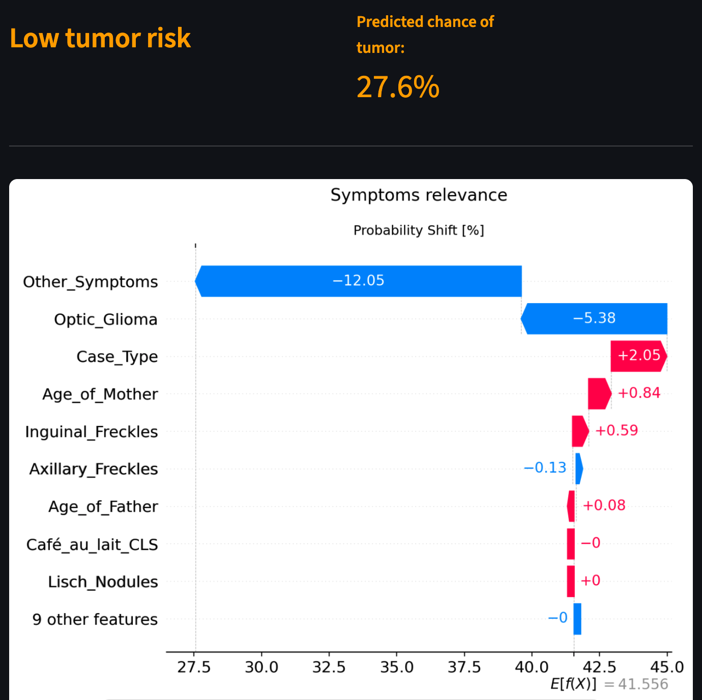
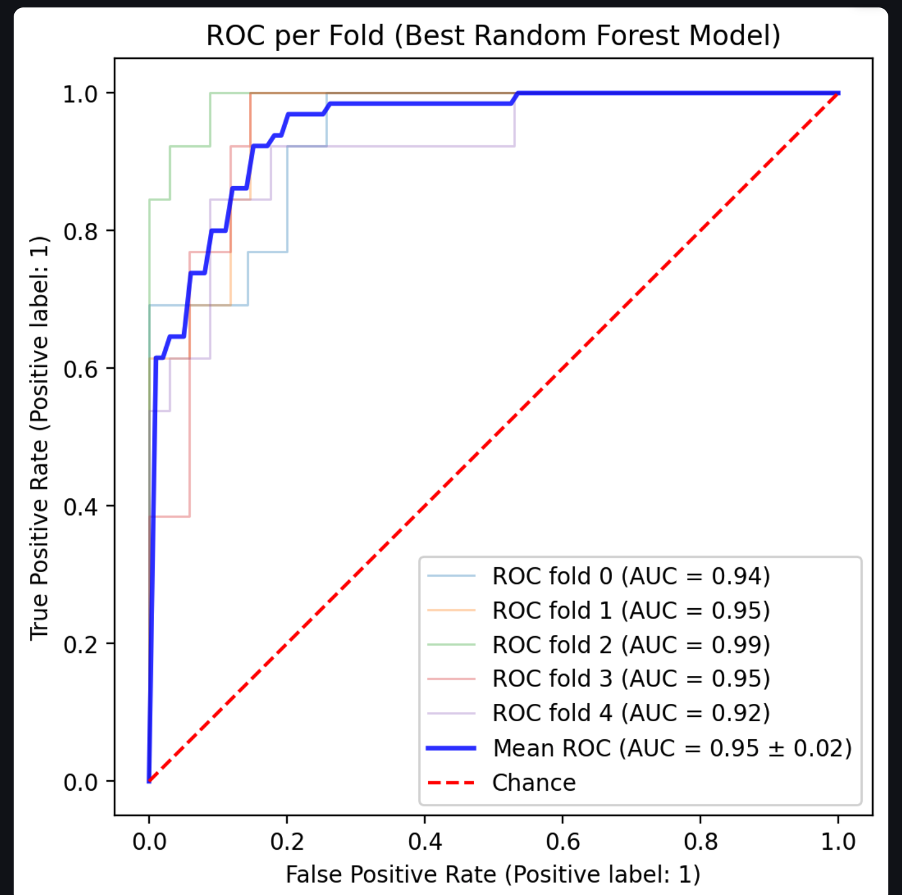

# NF1 Tumor Risk Classifier

A machine learning application for predicting tumor risk in Neurofibromatosis Type 1 (NF1) patients, built as a portfolio project demonstrating end-to-end ML workflow: data preprocessing, model training, evaluation, and explainability.

## Overview

The app trains and compares three classifiers — Logistic Regression, Random Forest, and XGBoost — on patient symptom data, then provides interactive tools to inspect model performance and understand individual predictions via SHAP.

## Features

- **Prediction**: enter patient symptoms and get a tumor risk estimate with a clinical risk level (Low / Medium / High), using per-model optimal decision thresholds.
- **Model comparison**: ROC curves, precision-recall curves, cross-validation results, and a metrics table (Recall, Precision, F1, AUC) across all three models.
- **SHAP explainability**:
  - Global view — beeswarm and bar charts showing overall feature importance, with a ranking table.
  - Individual view — waterfall plot explaining a single patient's prediction for a chosen model.
  - Comparative view — side-by-side waterfall plots across all three models for the same patient, plus a filterable table of misclassified or model-disagreement cases.


## Demo





## Modeling notes

- Logistic Regression uses a `ColumnTransformer` that scales only continuous features (age-related); binary symptom features are passed through unscaled, since scaling rare binary indicators produces distorted, disproportionately large SHAP contributions.
- Random Forest and XGBoost use no scaling, as tree-based splits are scale-invariant.
- SHAP values are in different native units depending on the model: Random Forest outputs probability directly, while Logistic Regression and XGBoost output log-odds. This is handled explicitly in the explainability code rather than assumed.
- Decision thresholds per model are chosen to maximize recall first (to minimize missed tumor cases), then precision among ties.

## Tech stack

Python, scikit-learn, XGBoost, SHAP, Streamlit, pandas, matplotlib.

## Project structure

```
├── app.py                  # App entry point and navigation
├── pages/
│   ├── home.py
│   ├── predict.py          # Single-patient prediction
│   ├── eda.py               # Exploratory data analysis
│   ├── models.py             # Model comparison and metrics
│   └── shap_page.py           # SHAP explainability dashboard
├── src/
│   ├── data_loader.py        # Loading models, scalers, thresholds, data
│   ├── model.py                # Prediction, thresholding, risk scoring, metrics
│   ├── explainability.py        # SHAP computation and plotting
│   └── enums.py
├── models/                      # Serialized models, preprocessor, thresholds
├── datasets/                      # Source data
└── notebook/                        # Training and experimentation
```

## Try it

The app is live on Streamlit Cloud — no installation needed, just open the link and use it in your browser.
Live app: [https://nf1-tumor-classifier.streamlit.app/](https://nf1-tumor-classifier.streamlit.app/)

## Running locally (optional)

```bash
pip install -r requirements.txt
streamlit run app.py
```

## Disclaimer

This project is for educational and demonstration purposes only. It is not a validated diagnostic tool and should not be used for actual clinical decision-making.

## License

See [LICENSE](LICENSE).
